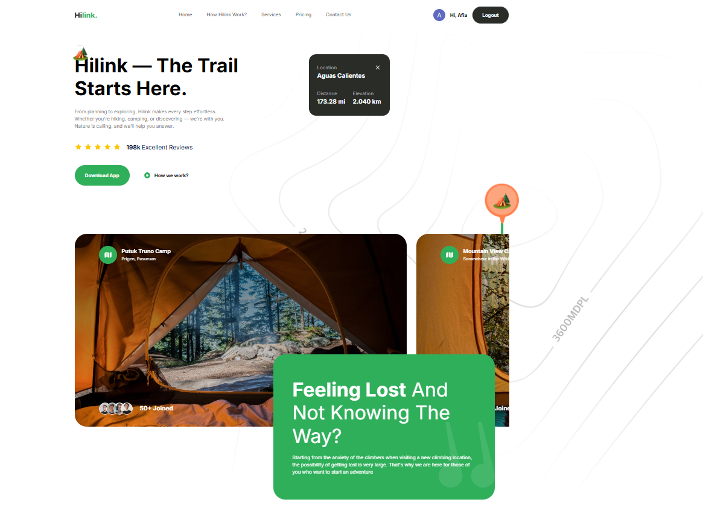
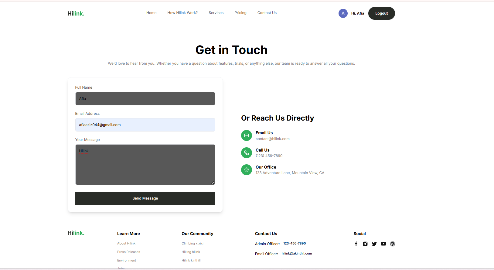
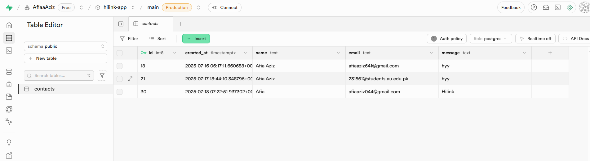

# HiLink

HiLink is a sleek, fully responsive web application built with Next.js that allows users to authenticate securely and submit their contact information with ease. The website is designed with a clean and modern user interface that ensures a smooth user experience across all devices.

Upon visiting the site, users can log in using NextAuth.js, which provides a secure and scalable authentication system. Once authenticated, users can fill out a contact form. The data entered in this form is validated and then submitted to Supabase, a powerful backend-as-a-service platform that stores the data in real-time.

This project highlights the integration of modern tools and frameworks like NextAuth.js for authentication and Supabase for database management, along with fast deployment using Vercel. It's a great example of a full-stack application that combines both frontend and backend functionalities.

---

## 🔗 Live Demo

Check out the live version here:  
👉 [https://hilink-sigma-lime.vercel.app/](https://hilink-sigma-lime.vercel.app/)

---

## 🚀 Features

- 🔐 Secure authentication using **NextAuth.js**
- 📬 Contact form with validation and submission
- ☁️ Real-time data storage with **Supabase**
- 📱 Fully responsive design for all devices
- ⚡ Hosted and deployed on **Vercel**
- 🌐 Modern and clean UI

---

## 🛠️ Tech Stack

- **Framework:** [Next.js](https://nextjs.org/)
- **Authentication:** [NextAuth.js](https://next-auth.js.org/)
- **Database:** [Supabase](https://supabase.com/)
- **Styling:** Tailwind CSS
- **Deployment:** [Vercel](https://vercel.com/)

---
## 📸 Screenshots

### 🏠 Homepage


### 📬 Contact Form


### 🧠 Supabase Backend (Database View)


---

## 📥 How to Use

```bash
# 1. Clone the repository
git clone https://github.com/your-username/hilink.git

# 2. Navigate to the project directory
cd hilink

# 3. Install dependencies
npm install

# 4. Create and configure the .env.local file with:
# - NEXTAUTH_SECRET
# - NEXTAUTH_URL
# - Supabase URL and anon/public key
# Example:
NEXTAUTH_SECRET=your_secret_key
NEXTAUTH_URL=http://localhost:3000
SUPABASE_URL=https://yourproject.supabase.co
SUPABASE_ANON_KEY=your_anon_key

# 5. Run the development server
npm run dev
